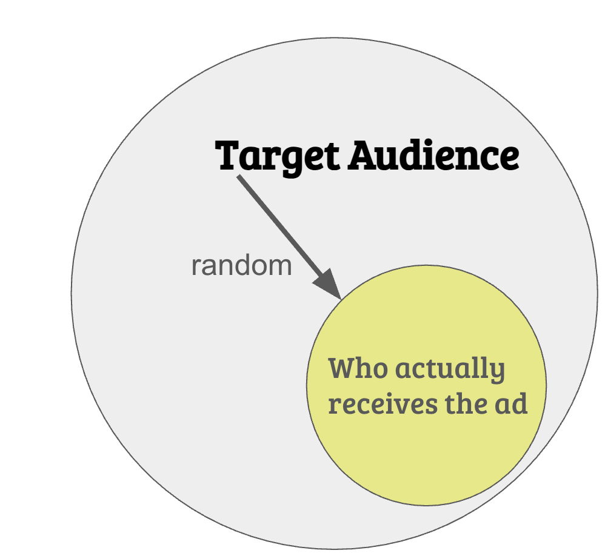

```{r setup, include=FALSE}
knitr::opts_chunk$set(fig.retina = 3, 
                      warning = FALSE, 
                      message = FALSE,
                      echo = F)

library(tidyverse)
```


### The "bad actors" story of political microtargeting
 
 


---


class: white

# Targeting is changing...

<center>

</center>


---

class: white

# Targeting is changing...

<center>

</center>


---

class: white

### The Role of Ad Delivery Algorithms in Digital Political Advertising


.pull-left[

.font140[
+ there is more than just targeting criteria:

]


]


.pull-right[

<center>

</center>


]


---

class: white

### The Role of Ad Delivery Algorithms in Digital Political Advertising


.pull-left[
.font140[
+ there is more than just targeting criteria:

+ advertisers can set targeting boundaries

+ ad delivery algorithms "decide" which individual users get ads from which advertiser


]

> In fact, we subsidize relevant ads in auctions, so more relevant ads often cost less and see more results. In other words, an ad that’s relevant to a person could win an auction against ads with higher bids. ~Meta Business Help Center


]


.pull-right[

<center>

</center>


]


---

class: white

<center>

</center>


---

class: white

<center>

</center>


---

class: white

<center>

</center>


---


class: white

<center>

</center>


---


class: white

<center>

</center>


---

### A (silly) example

.pull-left[
    
]

--

.pull-right[
    
F. Snow, obsessed with A Song of Ice and Fire
]


---


class: white

<center>

</center>


---

# “Additional online advertising transparency”  (DSA, Article 39) 

<br>

.font120[

> (2e) whether the advertisement was intended to be presented specifically to one or more particular groups of recipients of the service and if so, **the main parameters used for that purpose** including where applicable the main parameters used to exclude one or more of such particular groups;

]


---


class: white

### Prior Research (Ali et al., 2020,2021)

.pull-left[

]


.pull-right[

]


---

### Prior Research (Ali et al., 2020,2021)


When targeting the same audience, at the same time, with the same budget:

+ Ad delivery is heavily skewed along gendered and racial stereotypes
  + even without the intent of the advertiser [(Ali et al. 2020)](https://dl.acm.org/doi/10.1145/3359301)
  
--

.pull-left[
**Delivery remains skewed even with blank image**

Images invisible to humans but still detectable by algorithm:

+ yield **similar skews** in delivery

+ highlights importance of algorithm

+ less based on differences in user behavior/preferences
]

.pull-right[

]


---

### Prior Research (Ali et al., 2020,2021)


When targeting the same audience, at the same time, with the same budget:

Regarding political ads [(Ali et al., 2021)](https://dl.acm.org/doi/pdf/10.1145/3437963.3441801):

--

.pull-left[
+ **Skewed delivery**

  + Political ads more often delivered to ideologically congruent audience 
      + Bernie ads → higher % D; 
      + Trump ads → higher % R

+ **Increased cost**

  + Liberal ad to a liberal audience: *21 Dollar per 1000 users*; 
  + Conservative ad delivered to liberal audience: *40 Dollar per 1000 users*.
]

--

.pull-right[
**Results hold** 

+ when tricking Facebook into classifying non-partisan ads as partisan


]

---


class: white

### Evidence of Uneven Playing Field

<center>

</center>

---


## Why do uneven playing fields matter?

Democracy relies on the principle of *fair competition* between political entities


<br>

.pull-left[


🏛 **Campaign rules aimed to level the field**:
  + 🇺🇸 *Equal-time rule* 📡 *(US)*
  + 🇫🇷 *Equal airtime law* 📺 *(France)*
  
+ 💰 Campaign finance laws regulate spending to prevent undue influence


]

.pull-right[

<center>

</center>


]


<br>

> Advent of social media disrupts traditional campaigns and challenge regulations


---


class: white

<center>

</center>


---


class: white

### Evidence of Uneven Playing Field?

<center>

</center>

---

class: white

<br>
<br>


<center>

</center>


---

class: middle, center

### **United in Diversity, Divided by Algorithms?**

A Cross-National Examination of ***Ad Delivery Algorithms*** during the 2024 European Parliament Elections

*Fabio Votta, Simon Kruschinski, Mads Fuglsang Hove, Anamaria Dutceac Segesten, Márton Bene, Christina Gahn, Linn Sandberg, Jan Zilinsky, Claes de Vreese, James P. Cross, Ruth Dassonneville, Tom Dobber, and Benjamin Guinaudeau*

---

## **Research Aim**

- 🎯 In this study, we explore the **pricing of political advertisements** on Facebook  
- 🌍 Examining **cross-country** and **party** differences during the 2024 European Parliament Elections

.center[
**RQ1**: Do prices for political ads differ across _countries_ and _parties_?  

**RQ2**: What factors influence the price of political advertisements *between* parties?  
]

<center>

</center>


---

### **Pre-Registered Hypotheses**

.center[
> **RQ1**: Do prices for political ads differ across _countries_ and _parties_?  
]

<br>

--

<br>

.center[

📌 **H1**: The price for political advertisements differs across countries. 
]

<br>

--


.center[

📌 **H2**: Political parties are charged different prices for the same political ads.  
]


---

### **Exploratory Analysis**

> **RQ2**: What factors influence the price of political advertisements *between* parties?  


.center[
#### 📱 **Account Factors**  
 Characteristics of the Facebook accounts placing ads  
 e.g. follower count & past ad spending  
]


--

.center[
#### 🏛️ **Party Factors**  
 Characteristics of the party placing ads  
 e.g. support level & voter demographics  
]

--

.center[
#### 📊 **Market Factors**  
 Characteristics of the market environment in which ads are placed  
 e.g. audience demand & advertiser competition  
]


---

class: center, middle

# Design

	Prominent Account *Algorithm Audit Study* (PAAAS)


---

class: white

.font120[*35* parties in 8 countries placed **identical ads with the same settings**]


<center>

</center>

Germany, Denmark, Austria, Belgium, Sweden, Ireland, Hungary, Netherlands

---

class: white

.font120[*30* parties in 8 countries placed identical ads with the same settings **at the same time**]


<center>

</center>

Germany, Denmark, Austria, Belgium, Sweden, Ireland, Hungary, Netherlands

---

class: white

.font120[*30* parties in 8 countries placed identical ads with the same settings **at the same time**]


<center>

</center>

.pull-left[
**💰 Budget & Timing**
- €1/day for 7 days  
- 📅 Start Date: *April 29, 2024*  
- 📊 Outcome Measured: *Cost per 1k users*  
- 5 ads X 3 audiences X 30 parties = *450 ads*
]

.pull-right[
**🎯 Targeting Conditions**
- 🚫 No Targeting 
- 📢 Interested in Politics   
- 🎓 Below-University Education 
]

---

class: white

#### Do prices differ between countries? (RQ1)

<center>

</center>

+ **High variance across countries** (49% on average, 321% max.)

---

class: white

#### Do prices differ between parties? (RQ1)

<center>

</center>

+ **Within-country differences:**
  + 4% average variation (max. 27%)
  + Even *"small"* differences can lead to thousands of additional unique people reached

---

class: white

#### Do prices differ between parties? (RQ1) - Demographic differences

<center>

</center>

+ **Explore Data yourself!**
  + euroalgos.shinyapps.io/explore/
  
---

class: white


### What Drives Price Differences? (RQ2) - Account-Level

<center>

</center>

---

class: white

### What Drives Price Differences? (RQ2) - Party-Level

<center>

</center>

---

class: white

### What Drives Price Differences? (RQ2) - Market-Level

<center>

</center>

---

class: white

### What Drives Price Differences? (RQ2) - Market-Level

.pull-left[


]

.pull-right[

+ *15% price increase* when targeting (as opposed to no targeting)

<br>

+ *6% higher* for politically interested audiences

<br>

+ *25% higher* for low-education audiences

]

---


## Conclusion

+ Ad delivery algorithms (unintentionally?) favor some political actors

--

+ Within-country price variation:
  + Average 4% (max. 27%)
  + Significant exposure bias leads to thousands of differential reach

--

+ Key drivers:
  + Audience size
  + Spending history
  + Ideology (?)
  + Supranational parties (?)

--

+ The shift toward algorithmic ad delivery demands new approaches to platform accountability

+ For effective regulation, we need to address ad delivery systems holistically, not just traditional targeting.

+ Algorithmic access for researchers to audit independently 

---

class: white

### A Potential Solution? Transparency and Targeting of Political Advertising (TTPA)

The European Parliament suggested:

<br>

> (47k) [...] **online platforms should not be allowed to selectively deliver political advertisement within the targeted potential audiences** based on further processing of personal data. 

> **The actual recipients of the political advertisement should therefore only be randomly selected by the publisher**, without any further processing of personal data.

<br>


.font50[
Proposal for a REGULATION OF THE EUROPEAN PARLIAMENT AND OF THE COUNCIL on the transparency and targeting of political advertising (Text with EEA relevance) 2021/0381(COD) DRAFT [Document for trilogue meeting on 5 May] 03-05-2023 at 18h11


]

---

class: white

### A Potential Solution? Transparency and Targeting of Political Advertising (TTPA)

.pull-left[


The European Parliament suggested:

> (47k) [...] **online platforms should not be allowed to selectively deliver political advertisement within the targeted potential audiences** based on further processing of personal data. 

> **The actual recipients of the political advertisement should therefore only be randomly selected by the publisher**, without any further processing of personal data.


.font50[

Proposal for a REGULATION OF THE EUROPEAN PARLIAMENT AND OF THE COUNCIL on the transparency and targeting of political advertising (Text with EEA relevance) 2021/0381(COD) DRAFT [Document for trilogue meeting on 5 May] 03-05-2023 at 18h11


]

]

.pull-right[




]

---

class: white

### A Potential Solution? Transparency and Targeting of Political Advertising (TTPA)

.pull-left[


The European Parliament suggested:

> (47k) [...] **online platforms should not be allowed to selectively deliver political advertisement within the targeted potential audiences** based on further processing of personal data. 

> **The actual recipients of the political advertisement should therefore only be randomly selected by the publisher**, without any further processing of personal data.


.font50[

Proposal for a REGULATION OF THE EUROPEAN PARLIAMENT AND OF THE COUNCIL on the transparency and targeting of political advertising (Text with EEA relevance) 2021/0381(COD) DRAFT [Document for trilogue meeting on 5 May] 03-05-2023 at 18h11


]

]

.pull-right[


]

---


class: middle, center

# **Thank You for Listening!** Questions? 🎤  

<div style="text-align: center;">
    <div style="display: inline-block; text-align: left;">
        <p align="left">
            `r icons::icon_style(icons::fontawesome("link"),fill="black")`&nbsp;
            <a href="https://favstats.github.io/lunchlab25">favstats.github.io/lunchlab25 (Slides)</a> <br>  
            `r fontawesome::fa("bluesky", fill = "blue")`&nbsp; @favstats.eu <br>  
            `r icons::icon_style(icons::fontawesome("mastodon"),fill="#615ff7")`&nbsp; @favstats@fosstodon.org  
        </p>
    </div>
</div>

<br>
<br>

**United in Diversity, Divided by Algorithms?**

A Cross-National Examination of ***Ad Delivery Algorithms*** during the 2024 European Parliament Elections

*Fabio Votta, Simon Kruschinski, Mads Fuglsang Hove, Anamaria Dutceac Segesten, Márton Bene, Christina Gahn, Linn Sandberg, Jan Zilinsky, Claes de Vreese, James P. Cross, Ruth Dassonneville, Tom Dobber, and Benjamin Guinaudeau*


